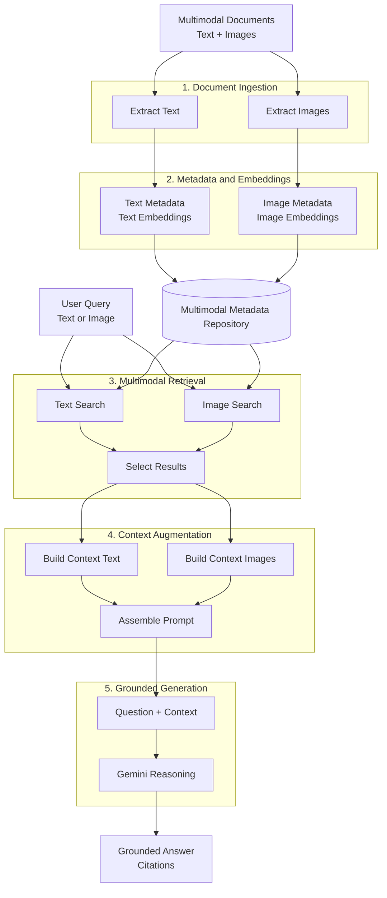

# Multimodal Retrieval-Augmented Generation using Gemini

[](https://colab.research.google.com/github/philipobiorah/Multimodal_Retrieval_Augmented_Generation_using_Gemini/blob/main/v2_colab_intro_multimodal_rag_colab.ipynb)

A practical, teaching-focused implementation of **Multimodal Retrieval-Augmented Generation (RAG)** using Gemini. The project demonstrates how to search and reason across rich PDF documents containing text, tables, charts, graphs and other images.

Unlike text-only RAG, this workflow builds searchable representations for both document text and visual content. A user can retrieve relevant text chunks, retrieve images using a text query, search for similar images using an image query, and combine the selected evidence for grounded generation with Gemini.

> The central idea is not simply to upload a PDF to Gemini. The system first retrieves the most relevant textual and visual evidence, augments the prompt with that evidence, and then asks Gemini to generate a grounded response.

## Project objectives

This repository demonstrates how to:

- extract text and images from PDF documents;
- split page text into overlapping chunks;
- generate text embeddings for pages and chunks;
- ask Gemini to create searchable image descriptions;
- generate multimodal embeddings for images;
- perform text-to-text retrieval;
- perform text-to-image retrieval;
- perform image-to-image retrieval;
- compare and reason across retrieved images;
- combine retrieved text and images in a multimodal RAG prompt;
- display source pages, image descriptions and retrieval citations.

## Multimodal RAG pipeline



## Retrieval modes

| Query modality | Search representation | Returned evidence |
|---|---|---|
| Text | Text chunk embeddings | Relevant text chunks |
| Text | Embeddings of Gemini-generated image descriptions | Relevant document images |
| Image | Image-only multimodal embeddings | Visually or semantically similar images |
| Text | Retrieved text and images together | Grounded multimodal answer |

### Text-to-text retrieval

The user submits a text question. The query embedding is compared with stored text-chunk embeddings using cosine similarity.

```text
Text query → Text embedding → Similarity search → Relevant text chunks
```

### Text-to-image retrieval

Gemini first creates a description of each extracted image. These descriptions are embedded as text. A text question can therefore retrieve the original image whose description is most relevant.

```text
Text query → Text embedding → Search image-description embeddings → Relevant images
```

### Image-to-image retrieval

An input image is converted into a multimodal embedding and compared with stored image embeddings.

```text
Image query → Image embedding → Similarity search → Similar images
```

## Why multimodal retrieval matters

The notebook includes a deliberately constructed example in which a text search finds a passage stating that the required figures are available in a following table. The actual values are stored in an image, so a text-only RAG request correctly responds that the answer is unavailable in the retrieved context.

Text-to-image retrieval then finds the relevant table and allows Gemini to extract the basic and diluted net income per share values. This illustrates an important principle:

> Relevant text is not always sufficient evidence.

## Repository contents

| File | Description |
|---|---|
| `v2_colab_intro_multimodal_rag_colab.ipynb` | Main Colab-ready notebook for the complete multimodal RAG workflow. |
| `use_intro_multimodal_rag (1).ipynb` | Additional notebook version used during development and experimentation. |
| `intro_multimodal_rag_utils.py` | Helper functions for PDF processing, chunking, embeddings, retrieval, Gemini calls, image display and citations. |
| `print_intro_multimodal_rag.ipynb.pdf` | Printable PDF export of the notebook for teaching, review or offline reading. |

## Models and representations used

The utility module includes calls to:

- `text-embedding-005` for text embeddings;
- `gemini-embedding-2` for multimodal image embeddings;
- a Gemini generation model selected in the notebook for image description, reasoning and answer generation.

The notebook stores several useful representations:

| Metadata field | Purpose |
|---|---|
| `text_embedding_page` | Represents the full page text. |
| `text_embedding_chunk` | Supports fine-grained text retrieval. |
| `img_desc` / image description | Gemini-generated explanation of visual content. |
| `text_embedding_from_image_description` | Enables text-to-image retrieval. |
| `mm_embedding_from_img_only` | Enables image-to-image retrieval. |
| `mm_embedding_from_text_desc_and_img` | Represents the image together with its description. |

## Getting started

### Option 1: Run in Google Colab

Use the badge at the top of this README or open:

`v2_colab_intro_multimodal_rag_colab.ipynb`

Then select:

```text
File → Save a copy in Drive
```

Run the notebook from the first cell and authenticate with a Google account that has access to your Google Cloud project.

### Option 2: Run locally

Clone the repository:

```bash
git clone https://github.com/philipobiorah/Multimodal_Retrieval_Augmented_Generation_using_Gemini.git
cd Multimodal_Retrieval_Augmented_Generation_using_Gemini
```

Create and activate a virtual environment.

#### macOS or Linux

```bash
python3 -m venv .venv
source .venv/bin/activate
```

#### Windows PowerShell

```powershell
py -m venv .venv
.venv\Scripts\Activate.ps1
```

Install the main dependencies:

```bash
python -m pip install --upgrade pip
pip install google-genai pymupdf pandas numpy pillow colorama rich ipython jupyterlab
```

Start JupyterLab:

```bash
jupyter lab
```

## Google Cloud prerequisites

You need:

1. A Google Cloud project with billing enabled.
2. The Vertex AI API enabled.
3. Permission to use Vertex AI, such as the `Vertex AI User` role.
4. Valid Application Default Credentials or Colab authentication.

For local development, authenticate with:

```bash
gcloud auth application-default login
gcloud config set project YOUR_PROJECT_ID
```

Set the project in the notebook:

```python
PROJECT_ID = "YOUR_PROJECT_ID"
LOCATION = "global"

client = genai.Client(
    enterprise=True,
    project=PROJECT_ID,
    location=LOCATION,
)
```

Do not commit credentials, service-account keys or secrets to the repository.

## Core workflow

### 1. Build document metadata

```python
text_metadata_df, image_metadata_df = get_document_metadata(
    model,
    pdf_folder_path,
    image_save_dir="images",
    image_description_prompt=image_description_prompt,
    embedding_size=1408,
)
```

This step:

- reads each PDF;
- extracts page text;
- divides text into overlapping chunks;
- generates page and chunk embeddings;
- extracts embedded images;
- asks Gemini to describe each image;
- generates image-related embeddings;
- stores source metadata for citations.

### 2. Retrieve relevant text

```python
matching_results_text = get_similar_text_from_query(
    query,
    text_metadata_df,
    column_name="text_embedding_chunk",
    top_n=3,
    chunk_text=True,
)
```

### 3. Retrieve relevant images using text

```python
matching_results_image = get_similar_image_from_query(
    text_metadata_df,
    image_metadata_df,
    query=query,
    column_name="text_embedding_from_image_description",
    image_emb=False,
    top_n=3,
    embedding_size=1408,
)
```

### 4. Retrieve similar images using an image

```python
matching_results_image = get_similar_image_from_query(
    text_metadata_df,
    image_metadata_df,
    query=query,
    column_name="mm_embedding_from_img_only",
    image_emb=True,
    image_query_path=image_query_path,
    top_n=3,
    embedding_size=1408,
)
```

### 5. Construct multimodal context

```python
context_text = [
    value["chunk_text"]
    for value in matching_results_chunks_data.values()
]
final_context_text = "\n".join(context_text)

context_images = []
for value in matching_results_image_fromdescription_data.values():
    context_images.extend(
        [
            "Image: ",
            value["image_object"],
            "Caption: ",
            value["image_description"],
        ]
    )
```

### 6. Generate a grounded response

```python
prompt = f"""
Answer the questions using the retrieved text and image context.
If the evidence is insufficient, respond with:
"Not enough context to answer".

Text context:
{final_context_text}

Image context:
{context_images}

{query}
"""

response = get_gemini_response(
    model,
    model_input=[prompt],
    stream=True,
)
```

## Citations and verification

The notebook provides helper functions for inspecting retrieved evidence:

```python
print_text_to_text_citation(
    matching_results_chunks_data,
    print_top=False,
    chunk_text=True,
)

print_text_to_image_citation(
    matching_results_image_fromdescription_data,
    print_top=False,
)
```

The citation output includes information such as:

- similarity score;
- source PDF;
- page number;
- text chunk;
- image path;
- page text;
- Gemini-generated image description.

A similarity score measures closeness in embedding space. It should not be interpreted as a guarantee that the result is factually correct.

## Suggested teaching sequence

1. Introduce text-only and multimodal RAG.
2. Build and inspect `text_metadata_df`.
3. Build and inspect `image_metadata_df`.
4. Run the text-only EPS search.
5. Show why the retrieved text is insufficient.
6. Run text-to-image retrieval and display the table.
7. Generate the structured answer from the image evidence.
8. Demonstrate image-to-image retrieval.
9. Retrieve and compare multiple charts.
10. Run the complete multimodal RAG workflow.
11. Inspect text and image citations.

## Limitations

This project is intended for learning and small-scale experimentation.

- Image descriptions depend on the quality and resolution of the source images.
- PDF text extraction may lose table structure or reading order.
- Multimodal processing can require significant time, quota and cost.
- Large `top_n` values may add irrelevant context.
- High similarity does not guarantee that evidence answers the question.
- The notebook uses in-memory Pandas DataFrames rather than a persistent production vector database.
- The teaching workflow is not designed for large document collections without further engineering.

## Production extensions

Possible improvements include:

- a persistent vector database;
- document-level and metadata filtering;
- hybrid retrieval and reranking;
- duplicate-result removal;
- claim-level citations;
- retrieval and answer evaluation datasets;
- caching, monitoring and cost controls;
- access control for private documents;
- video segmentation, transcript retrieval and timestamp citations.

## Extending the design to video

The same RAG pattern can be applied to video:

```text
Video
  ↓
Segment into scenes or time windows
  ↓
Create transcripts and visual descriptions
  ↓
Generate searchable representations
  ↓
Retrieve relevant segments
  ↓
Pass selected video evidence to Gemini
  ↓
Return a grounded answer with timestamps
```

## Costs

Gemini generation and embedding requests can incur Google Cloud charges. Review your project quotas and pricing before processing large files or running repeated experiments.

## Acknowledgement

This project was developed as a teaching-focused adaptation of the Google Skills lab:

**Inspect Rich Documents with Gemini Multimodality and Multimodal RAG**  
https://www.skills.google/course_templates/981/labs/629204

The repository restructures the workflow for use in Colab and for explaining the concepts progressively, from individual retrieval modes to a complete multimodal RAG pipeline.

## Author

**Philip Obiorah, PhD**  
Learning Development Coach in Computing, University of Buckingham  
Lead, GDG Cloud Port Harcourt

## Contributing

Contributions, corrections and suggestions are welcome. You can open an issue or submit a pull request describing the proposed improvement.

## Disclaimer

The financial documents and examples are used for educational demonstration. The generated outputs should not be treated as financial or investment advice.
